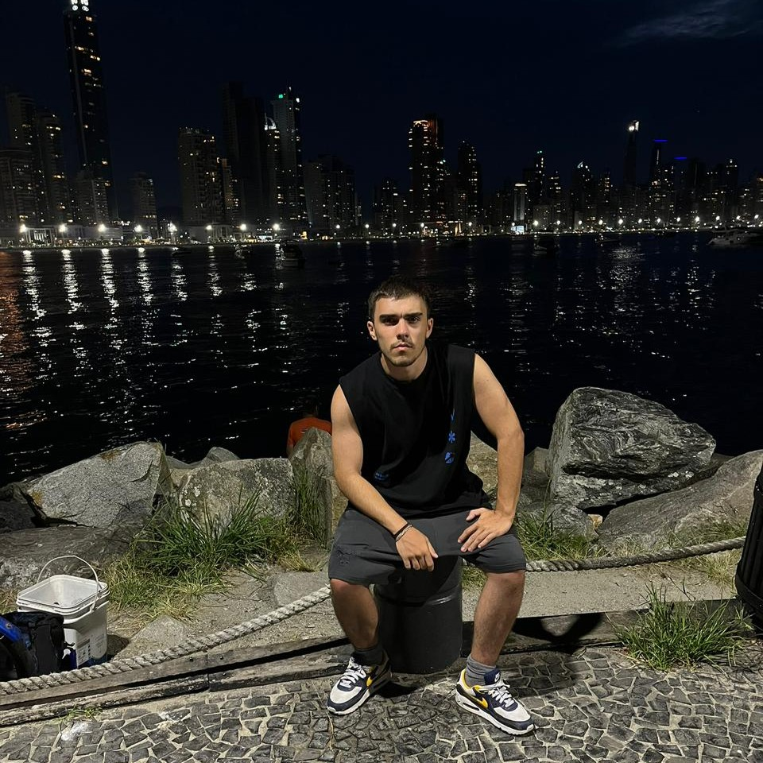
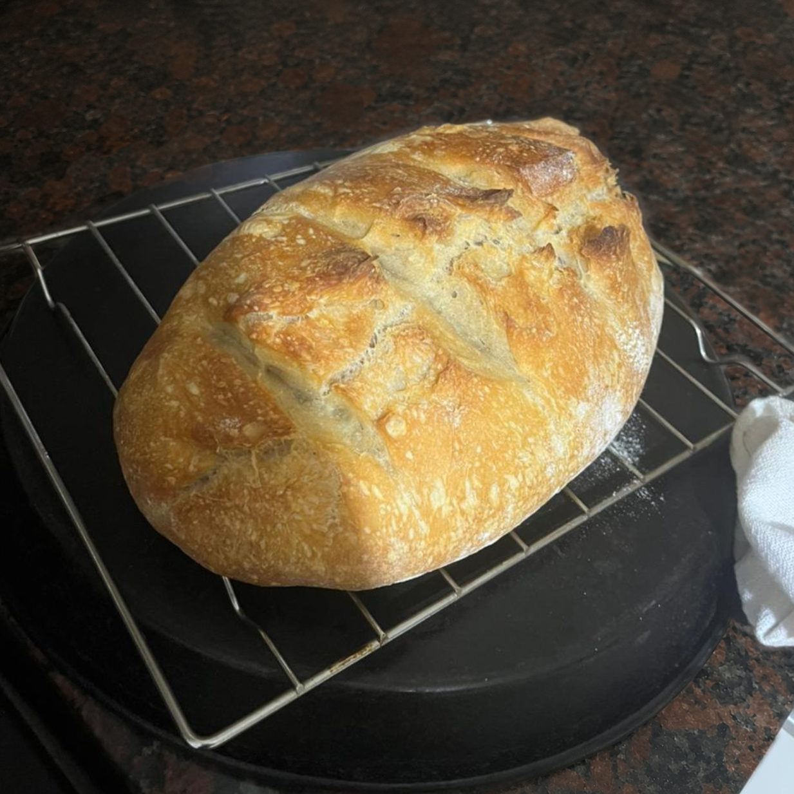

## Cristian Fernandez Bonfranceschi
### 233.863-4

---

  

---

## Un poco de mí

Como dije el primer día, me gusta mucho el cine y me apasiona ir. Soy muy fan de Marvel y me gustaría decir que tengo algún personaje favorito, pero me cuesta mucho elegir favoritos.

---

La música me gusta mucho, no puedo viajar sin Spotify. Fui a muchos recitales a lo largo de mi vida y espero poder ir a más. La música en vivo se siente distinta.

> _"Nothing in life is promised except death. If you had the opportunity to play this game of life, you need to appreciate every moment. A lot of people don't appreciate their moment until its passed."_
---

Me encanta comer y algo que siempre está presente en nuestras vidas es el pan, por eso me obsesioné y empecé a hacer pan. Al principio costó, me salieron varias piedras, pero bueno, la práctica hace al maestro y ahora puedo decir que hago un pan espectacular. 
Descubri que el secreto para que te salga un pan rico, es la perseverancia y la paciencia. Hacer un pan es facil, pero exige tiempo, te obliga a no precipitarte y a dejar el impulso de controlar, y eso es bueno para la mente. La paciencia, el cuidado y la atencion se ven muy recompensados, convirtiendo unos ingredientes sencillos, en un pan dorado y crujiente.

  

